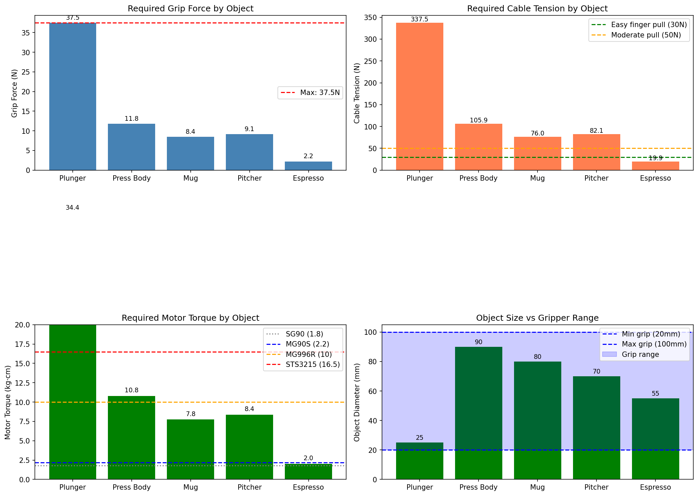

# Stack

**Proprioceptive data collection and diffusion policy for dexterous manipulation.**

Stack enables collecting human demonstrations with joint-level proprioception using a custom instrumented glove, then training diffusion policies that can be deployed on robot hands.

## Motivation

Current imitation learning systems like [UMI](https://github.com/real-stanford/universal_manipulation_interface) capture wrist pose + gripper width (8D). This limits what behaviors can be learned — a single scalar can't represent the rich finger configurations needed for dexterous manipulation.

Stack captures **11D proprioception** (7D wrist pose + 4 joint angles), enabling policies to learn individual finger behaviors, not just open/close.

| System | Proprioception | Dimensions |
|--------|---------------|------------|
| UMI | Pose + gripper width | 8D |
| **Stack** | **Pose + 4 joint angles** | **11D** |

## Key Features

- **Rich proprioception**: 4 magnetic encoders capture individual finger articulation
- **iPhone ultrawide tracking**: COLMAP SfM provides 6DoF wrist pose from 120° FOV video
- **Custom hardware**: 3D printed glove with ESP32, AS5600 encoders, BLE communication
- **Diffusion policy**: ResNet18 visual encoder + ConditionalUnet1D, matching Chi et al. (RSS 2023)

## Architecture

```
┌─────────────────────────────────────────────────────────────────┐
│                        DATA COLLECTION                          │
├─────────────────────────────────────────────────────────────────┤
│                                                                 │
│   ┌─────────────┐    ┌─────────────┐    ┌─────────────┐        │
│   │   iPhone    │    │   Glove     │    │   Laptop    │        │
│   │  Ultrawide  │    │  Encoders   │    │   Logger    │        │
│   │  (120° FOV) │    │             │    │             │        │
│   │  RGB 60Hz   │───▶│  Joints(4D) │───▶│  Zarr DB    │        │
│   │  + IMU      │    │  100Hz BLE  │    │             │        │
│   └─────────────┘    └─────────────┘    └─────────────┘        │
│         │                                                       │
│         ▼                                                       │
│   ┌─────────────┐                                               │
│   │  COLMAP SfM │  Offline pose recovery                        │
│   │  → Pose(7D) │  from ultrawide frames                        │
│   └─────────────┘                                               │
│                                                                 │
└─────────────────────────────────────────────────────────────────┘
                              │
                              ▼
┌─────────────────────────────────────────────────────────────────┐
│                         TRAINING                                │
├─────────────────────────────────────────────────────────────────┤
│                                                                 │
│   Observations ────▶ Visual Encoder ────┐                      │
│   (RGB)              (ResNet18)         │                      │
│                                         ├──▶ Diffusion ──▶ Actions
│   Proprioception ──▶ State Encoder ─────┘    Policy     (11D)  │
│   (Pose + Joints)    (MLP)                   (UNet1D)          │
│                                                                 │
└─────────────────────────────────────────────────────────────────┘
```

## Observation Space

| Source | Dimensions | Description |
|--------|------------|-------------|
| COLMAP pose | 7 | Position (3) + Quaternion (4) |
| Index MCP | 1 | Metacarpophalangeal joint angle |
| Index PIP | 1 | Proximal interphalangeal joint angle |
| 3-Finger MCP | 1 | Combined middle/ring/pinky MCP |
| 3-Finger PIP | 1 | Combined middle/ring/pinky PIP |
| **Total** | **11** | Full proprioceptive state |

## Hardware

### Instrumented Glove
- 4x AS5600 magnetic encoders (12-bit, 100Hz via I2C)
- TCA9548A I2C multiplexer
- ESP32 microcontroller (Serial + BLE dual output)
- 3D printed on Bambu Lab P1S — finger channels, palm mount, magnet housings

<p align="center">
  
  
</p>

### Tracking
- iPhone ultrawide camera (120° FOV, 60 FPS)
- COLMAP SfM for offline pose recovery
- IMU-based scale calibration

See [`hardware/DESIGN.md`](hardware/DESIGN.md) for full design documentation.

## Training Results

Training on 17 demonstrations (pick-and-place, ~25-30s each) on BU SCC V100 GPUs:

- **Architecture**: ResNet18 visual encoder + ConditionalUnet1D (~12M parameters)
- **Loss**: 0.62 → 0.03 by epoch 2
- **Training speed**: ~3.5 min/epoch, 286 batches/epoch
- **Schedule**: 100 diffusion steps, cosine beta, learning rate 1e-4

## Current Status

- [x] Hardware: glove assembled, 3 of 4 encoders working
- [x] Data collection: 17 demo sessions collected
- [x] COLMAP processing: all 17 sessions processed locally
- [x] Training: running on BU SCC (V100), loss converging
- [ ] Evaluation: download checkpoint, analyze predictions
- [ ] Scale calibration on collected sessions
- [ ] Replace broken AS5600 encoder

## Installation

```bash
# Clone
git clone https://github.com/corneliusgruss/stack.git
cd stack

# Install (with training dependencies)
pip install -e ".[train]"

# Or minimal install for data collection only
pip install -e .
```

### ESP32 Firmware

```bash
# Install Arduino IDE or PlatformIO
# Open firmware/encoder_reader/encoder_reader.ino
# Flash to ESP32
```

## Quick Start

### 1. Collect Demonstrations

```bash
# Start data collection session
stack-collect --session demo_01

# In another terminal, start iPhone recording
# (iOS app documentation coming soon)
```

### 2. Process Data

```bash
# Run COLMAP SfM on raw sessions
python -m stack.scripts.run_slam --data-dir data/raw

# Convert raw sessions to training format
python -m stack.data.process --input data/raw --output data/processed
```

### 3. Train Policy

```bash
# Train diffusion policy
stack-train --config configs/default.yaml

# With W&B logging
stack-train --config configs/default.yaml --wandb
```

### 4. Evaluate

```bash
# Evaluate on held-out demonstrations
stack-eval --checkpoint outputs/checkpoint_0100.pt --data data/processed/val
```

## Project Structure

```
stack/
├── stack/                  # Main Python package
│   ├── data/               # Session loading, encoder comm, dataset
│   ├── policy/             # Diffusion policy (ResNet18 + ConditionalUnet1D)
│   ├── viz/                # Visualization tools
│   └── scripts/            # CLI: collect, train, eval, run_slam
├── ios/                    # iPhone capture app (ultrawide, BLE)
├── firmware/               # ESP32 encoder reader (Serial + BLE)
├── hardware/               # CAD files and design docs
│   ├── DESIGN.md           # Full hardware design documentation
│   ├── cad/exports/        # STL/STEP exports
│   └── docs/               # Design diagrams
├── configs/                # Training configurations
├── tests/                  # Unit tests (16/16 passing)
└── data/                   # Local data storage (gitignored)
```

## References

- [Diffusion Policy](https://github.com/real-stanford/diffusion_policy) - Chi et al. RSS 2023
- [UMI](https://github.com/real-stanford/universal_manipulation_interface) - Chi et al. RSS 2024
- [UMI-FT](https://github.com/real-stanford/UMI-FT) - Force-aware manipulation

## License

MIT

---

*Built by Cornelius Gruss | ME740 Vision, Robotics, and Planning | BU 2026*
